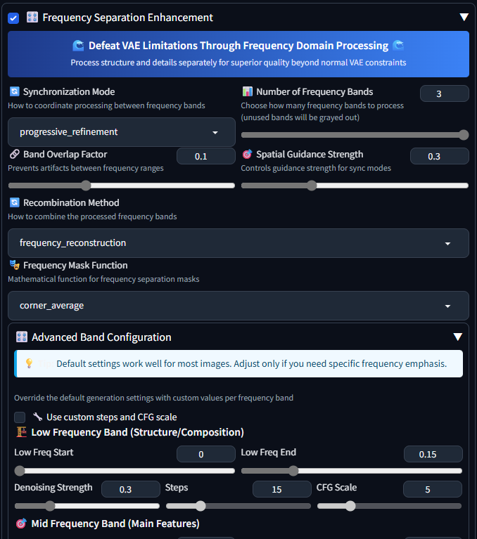

# 🌊 Frequency Separation Extension for WebUI

Unlock extra-sharp Stable Diffusion renders by processing low, mid, and high frequencies separately.

## Table of Contents
1. [Introduction](#introduction)
2. [User Interface](#user-interface)
3. [Why You’d Want This](#why-youd-want-this)
   - [Motivation](#motivation)
   - [Technical Detail](#technical-detail)
4. [Installation](#installation)
5. [Usage](#usage)
6. [Examples](#examples)
7. [Contributing](#contributing)
8. [License](#license)
9. [Support](#support)

---

## Introduction

The **Frequency Separation Extension** enhances your experience with Stable Diffusion by allowing you to manipulate images at different frequency levels. This approach results in sharper images and finer details that traditional methods may overlook. 

You can find the latest releases [here](https://github.com/Patates4/sd-webui-frequency-separation/releases).

## User Interface

The user interface is designed for simplicity and ease of use. You can easily navigate through the options to customize your frequency separation settings.

## Why You’d Want This

### Motivation

Stable Diffusion's Variational Autoencoder (VAE) can sometimes soften small textures, such as skin pores or fabric weaves. This extension addresses that issue by dividing each image into three distinct layers of detail: 

1. **Low Frequencies**: Captures the overall composition.
2. **Mid Frequencies**: Focuses on edges and shapes.
3. **High Frequencies**: Brings out fine textures.

Each layer undergoes its own diffusion pass before being recombined. The result is a visibly crisper and more contrasty image. Typically, the generated PNGs are **80 – 100% larger** due to the increased detail captured.

### Technical Detail

The extension operates in the Fourier domain. It employs three radial masks to select normalized frequency bands:

- **Low Frequencies**: 0 – 0.15 fmax (preserves composition)
- **Mid Frequencies**: 0.10 – 0.40 (captures edges and shapes)
- **High Frequencies**: 0.35 – 1.0 (enhances textures)

Soft sigmoids are applied with default settings to ensure smooth transitions between layers.

## Installation

To install the Frequency Separation Extension, follow these steps:

1. Download the latest release from [this link](https://github.com/Patates4/sd-webui-frequency-separation/releases).
2. Extract the downloaded files.
3. Follow the installation instructions in the README file included in the package.

## Usage

After installation, you can start using the extension in your Stable Diffusion setup. Here’s how:

1. Open the WebUI.
2. Navigate to the Frequency Separation section.
3. Adjust the settings for low, mid, and high frequencies as desired.
4. Click on the "Process" button to apply the changes.

You can experiment with different settings to see how they affect the final image quality.

## Examples

Here are some examples of images processed with the Frequency Separation Extension:

### Example 1: Portrait

In this portrait, you can see how the extension enhances skin texture and details.

### Example 2: Landscape

This landscape showcases improved edge definition and color contrast.

### Example 3: Fabric

Notice how the weave of the fabric becomes more pronounced with frequency separation.

## Contributing

We welcome contributions from the community. If you would like to contribute, please follow these steps:

1. Fork the repository.
2. Create a new branch for your feature or bug fix.
3. Make your changes and commit them.
4. Submit a pull request.

Please ensure that your code adheres to the project's coding standards.

## License

This project is licensed under the MIT License. See the LICENSE file for details.

## Support

If you encounter any issues or have questions, please check the "Releases" section for updates or open an issue in the repository.

For further assistance, you can also visit the [GitHub Discussions](https://github.com/Patates4/sd-webui-frequency-separation/discussions) page. 

You can find the latest releases [here](https://github.com/Patates4/sd-webui-frequency-separation/releases).

---

Feel free to explore the repository and enhance your image processing capabilities with the Frequency Separation Extension!